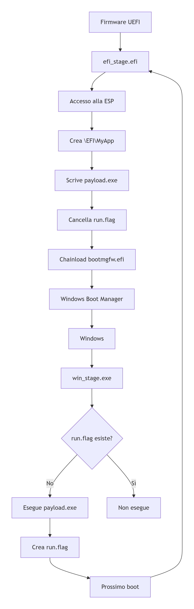

# Sample_BootKit-Gate
Sample Bootkit for Windows

**Bootkit: il codice che infetta il PC prima ancora che il sistema operativo si accenda. Ecco come agisce.**

I bootkit sono tra le minacce più subdole del panorama cybersecurity. Non si limitano a infettare il sistema operativo: agiscono prima che Windows si avvii, partendo dalla partizione di boot (MBR/GPT, VBR) al bootloader, fino al firmware UEFI. Opera quindi in fase pre-OS, con privilegi superiori a quelli del kernel stesso, e può bypassare o disattivare meccanismi di sicurezza come Secure Boot, ELAM, PatchGuard e antivirus. È di fatto un rootkit pre-OS: persistente, stealth e difficile da rimuovere anche dopo formattazione o reinstallazione del sistema operativo. 
In questo articolo documento in modo tecnico e difensivo un componente: efi_stage, un’applicazione EFI personalmente sviluppata che fa parte di una catena di persistenza pre-OS.

# ⚠️ DISCLAIMER 

This repository is for **educational and defensive research purposes only**. 
The code and analysis concern a malware component (UEFI bootkit) and are provided 
**solely to understand pre-OS threats, improve detection, and train IT/security staff**.

- ❌ No instructions for compiling, installing, distributing, or using the code.
- ❌ No operational payloads, ready-to-use binaries, or attack instructions.
- ❌ No promotion, facilitation, or support of illegal activities.

The author **assumes no liability** for misuse, damage, or legal violations 
arising from the use of this information. 
Using this knowledge to attack systems without authorization is **prohibited and punishable by law**.
